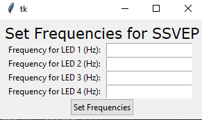

# BCI SSVEP Stimulus
Author: James Chen

Python script opens a GUI that controls Arduino MEGA to flash upto 16 groups of LED's at integer frequencies between 1Hz and 100Hz, as well as at diffrent phases. (0, 90, 180, 270)

Note: Acutal Frequency will be sleightly lower then desired. Around 99% accuracy

# How to run this program
Upload `pi_to_arduino.ino` to arduino MEGA and connect LED's as well as resistors to corrosponding pins. Run `set_frequencies.py` on Raspberry Pi by navigating to the correct directory in the terminal, and running `python3 set_frequencies.py`. Ensure that the USB cable (same one to program Arduino) is plugged in for serial connection. This will open a GUI to set the desired LED frequencies and phases.

Frequency Setting GUI:

