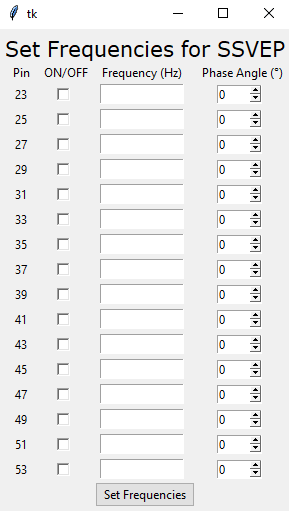
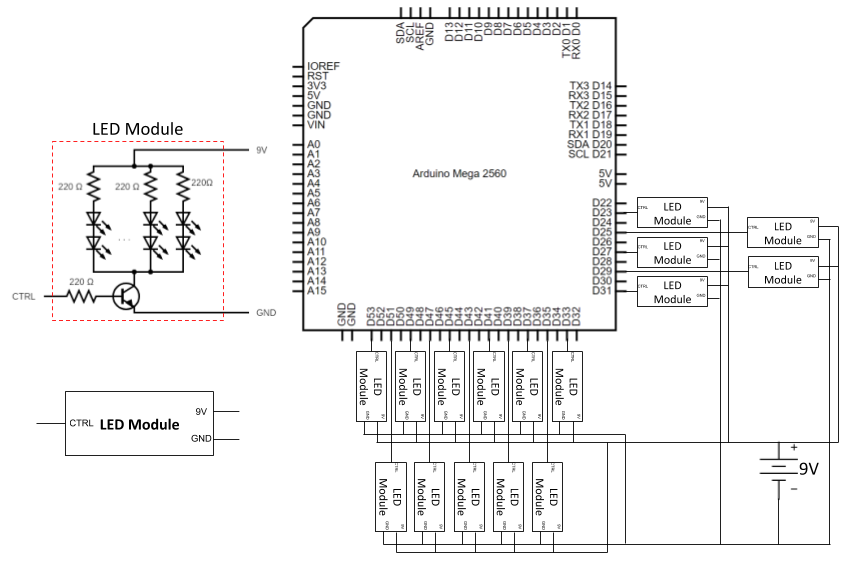

# BCI SSVEP Stimulus
Author: James Chen, Eli Kinney-Lang

Contains multiple different methods to control an SSVEP BCI wheelchair system

**SSVEP LED Control**

Python script `set_frequencies.py` opens a GUI that controls an Arduino MEGA to flash up to 16 groups of LED's at 
integer frequencies between 1Hz and 100Hz, as well as at different phases. (0, 90, 180, 270)
 Actual Frequency will be slightly lower then desired. Around 99% accuracy
 
 ** Control of Wheelchair**
 
 `control_methods.py` will open a tk terminal for the user to select their desired control method. 
 Options are: keyboard via cable connection, keyboard via bluetooth connection, and sample EEG data
 from public database.
 
 Once the user picks a control method the program will either open a pygame window for keyboard
 control or begin EEG data streaming. 
 
 
 **Arduino Code**
 
 The directory `/arduino_bci_mega` and `/arduino_bci_nano` contains code to upload to the Arduino
, this code can  run the the LED frequencies, drive the wheelchair control systems and can 
 sense obstacles and drops around the wheelchair if enabled.
 
 

# How to run this program
1) Upload `/arduino_bci_mega` or `/arduino_bci_nano` to Arduino MEGA/Nano and connect all peripherals to 
Arduino (see possible circuit implementation). NOTE that the Arduino nano is not yet capable of running
the LED's flashing at the same time.
 
2) Run `set_frequencies.py` on 
Raspberry Pi/PC by navigating to the correct directory in the terminal, and running `python3 
set_frequencies.py`. Ensure that the USB cable (same one to program Arduino) is plugged in
 for serial connection or that an appropriate bluetooth module is connected. This will open a GUI to set
  the desired LED frequencies and phases.

3) Once SSVEP LED's are set (optional when not doing actual live in person trials) run `control_methods.py`
to begin sending drive data to the arduino and driving the motors.

# Frequency Setting GUI:

# Keyboard Control Window

# Possible Circuit Implementation for LED's:
